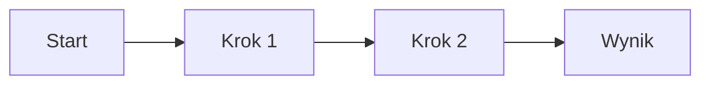

# Notion Page Builder — Skill do tworzenia pięknych stron Notion

> Buduj profesjonalne strony Notion z bogatym formatowaniem, kolorami, kolumnami, calloutami i bazami danych. Idealne do lead magnetów, baz wiedzy, dashboardów i dokumentacji.

## Kiedy aktywować
- "zbuduj stronę Notion", "stwórz stronę w Notion", "notion page"
- "lead magnet w Notion", "baza wiedzy Notion"
- "dashboard Notion", "landing page Notion"

## Workflow

### 1. Pobierz specyfikację Markdown
ZAWSZE na początku pobierz spec:
```
ReadMcpResourceTool(server="claude.ai Notion", uri="notion://docs/enhanced-markdown-spec")
```

### 2. Ustal parent page
Zapytaj usera o URL strony-rodzica lub stwórz standalone. Użyj `notion-fetch` by pobrać strukturę.

### 3. Zbuduj stronę
Użyj `notion-create-pages` z bogatym Notion Markdown.

---

## Design System — Gotowe wzorce

### Palety kolorów do sekcji
```
Nagłówek hero:     blue_bg lub purple_bg
Sekcja treści:     brak (domyślny biały)
Wyróżnienie:       yellow_bg lub orange_bg
Ostrzeżenie:       red_bg
Sukces/CTA:        green_bg
Neutralne info:    gray_bg
```

### Ikony sekcji (callout)
```
📌 Ważne / Pinned       💡 Tip / Insight
⚡ Akcja / Quick win     🎯 Cel / Target
📊 Dane / Metryki       🔑 Klucz / Key takeaway
⚠️ Uwaga / Warning      ✅ Done / Checklist
🚀 Start / Launch       📝 Notatka / Note
🧠 Mindset / Thinking   💰 Pieniądze / Revenue
🔗 Link / Resource      📅 Data / Deadline
❓ FAQ / Pytanie        🏆 Wynik / Achievement
```

### Szablon: Hero Section
```markdown
<callout icon="🚀" color="blue_bg">
	**TYTUŁ STRONY**
	Podtytuł opisujący zawartość lub wartość
</callout>

---
```

### Szablon: Sekcja z kolumnami (2 kolumny)
```markdown
<columns>
	<column>
		### 📊 Lewa kolumna
		Treść lewej kolumny z **pogrubieniami** i *kursywą*
	</column>
	<column>
		### 🎯 Prawa kolumna
		Treść prawej kolumny
	</column>
</columns>
```

### Szablon: Sekcja z kolumnami (3 kolumny)
```markdown
<columns>
	<column>
		### Kolumna 1
		Treść
	</column>
	<column>
		### Kolumna 2
		Treść
	</column>
	<column>
		### Kolumna 3
		Treść
	</column>
</columns>
```

### Szablon: Feature Card (callout)
```markdown
<callout icon="⚡" color="yellow_bg">
	**Nazwa funkcji**
	Opis funkcji w 1-2 zdaniach.
</callout>
```

### Szablon: Step-by-step
```markdown
<callout icon="1️⃣">
	**Krok 1: Tytuł**
	Opis kroku
</callout>

<callout icon="2️⃣">
	**Krok 2: Tytuł**
	Opis kroku
</callout>

<callout icon="3️⃣">
	**Krok 3: Tytuł**
	Opis kroku
</callout>
```

### Szablon: FAQ (toggle)
```markdown
## ❓ Najczęściej zadawane pytania

<details>
<summary>Pytanie 1?</summary>
	Odpowiedź na pytanie 1.
</details>

<details>
<summary>Pytanie 2?</summary>
	Odpowiedź na pytanie 2.
</details>
```

### Szablon: Pricing / Porównanie (tabela)
```markdown
<table fit-page-width="true" header-row="true" header-column="true">
	<colgroup>
		<col>
		<col>
		<col>
		<col>
	</colgroup>
	<tr color="blue_bg">
		<td>**Funkcja**</td>
		<td>**Basic**</td>
		<td>**Pro**</td>
		<td>**Enterprise**</td>
	</tr>
	<tr>
		<td>Cena</td>
		<td>49 zł/mies</td>
		<td>149 zł/mies</td>
		<td>Na zapytanie</td>
	</tr>
</table>
```

### Szablon: CTA Section
```markdown
---

<callout icon="🚀" color="green_bg">
	**Gotowy, żeby zacząć?**
	[Kliknij tutaj, aby rozpocząć →](https://link.com)
</callout>
```

### Szablon: Testimonial / Cytat
```markdown
> *"Cytat od klienta lub użytkownika który podsumowuje wartość."*
> — **Imię Nazwisko**, Stanowisko {color="gray"}
```

### Szablon: Metric Cards (3 kolumny)
```markdown
<columns>
	<column>
		<callout icon="📊" color="blue_bg">
			**2,847**
			Użytkowników
		</callout>
	</column>
	<column>
		<callout icon="💰" color="green_bg">
			**149K PLN**
			Przychód MRR
		</callout>
	</column>
	<column>
		<callout icon="⭐" color="yellow_bg">
			**4.9/5**
			Średnia ocena
		</callout>
	</column>
</columns>
```

### Szablon: Table of Contents
```markdown
<table_of_contents/>
```

### Szablon: Divider z nagłówkiem
```markdown
---

## 📌 Nazwa sekcji {color="blue"}
```

### Szablon: Image z captionem
```markdown

```

### Szablon: Toggle Heading (rozwijalna sekcja)
```markdown
## Tytuł sekcji {toggle="true"}
	Treść ukryta pod toggle
	- Punkt 1
	- Punkt 2
```

### Szablon: Mermaid Diagram
````markdown

````

### Szablon: Code Block
````markdown
```python
def hello():
    print("Hello from Notion!")
```
````

---

## Gotowe layouty stron

### Layout: Lead Magnet / Freebie
```
1. Hero callout (blue_bg) — tytuł + opis wartości
2. Table of Contents
3. --- divider
4. Sekcja "Co dostaniesz" — 3 kolumny z calloutami
5. --- divider
6. Główna treść — h2 + paragrafy + callout tips
7. --- divider
8. FAQ — toggle questions
9. --- divider
10. CTA callout (green_bg) — link do action
```

### Layout: Baza Wiedzy / Wiki
```
1. Hero callout — nazwa bazy + opis
2. Table of Contents
3. --- divider
4. Kategorie jako h2 toggle headings
5. Pod każdą kategorią — lista artykułów jako subpages
6. FAQ na dole
```

### Layout: Dashboard / Status Page
```
1. Hero callout — "Stan na [data]"
2. Metric cards (3 kolumny)
3. --- divider
4. Sekcje z tabelami lub bazami danych inline
5. Notatki / komentarze na dole
```

### Layout: Oferta / Sales Page
```
1. Hero callout (purple_bg) — headline + subheadline
2. Problem — callout red_bg
3. Rozwiązanie — callout green_bg
4. Funkcje — 3 kolumny calloutów
5. Pricing table
6. Testimoniale — cytaty
7. FAQ — toggles
8. CTA — callout green_bg z linkiem
```

---

## Zasady tworzenia stron

1. **Zawsze używaj calloutów** do wyróżnień — nie gołego tekstu
2. **Kolumny (2-3)** do prezentacji obok siebie
3. **Divider `---`** między sekcjami — czytelność
4. **Toggle headings** do długich treści — nie przytłaczaj
5. **Kolory oszczędnie** — max 2-3 kolory na stronę
6. **Ikony emoji** w calloutach i nagłówkach — wizualna nawigacja
7. **Table of Contents** na stronach dłuższych niż 3 sekcje
8. **Tabele z header-row** — zawsze z nagłówkiem
9. **Cytaty** na social proof
10. **CTA na końcu** — zawsze kończ stroną z akcją

## Narzędzia Notion MCP

| Narzędzie | Kiedy użyć |
|-----------|-----------|
| `notion-fetch` | Pobrać strukturę istniejącej strony/bazy |
| `notion-create-pages` | Stworzyć nową stronę z treścią |
| `notion-update-page` | Edytować istniejącą stronę |
| `notion-create-database` | Stworzyć bazę danych (SQL DDL) |
| `notion-create-view` | Dodać widok (table/board/gallery/calendar) |
| `notion-search` | Znaleźć strony w workspace |

## Ważne

- **Notion Markdown ≠ Standard Markdown** — zawsze sprawdzaj spec
- **Taby do indentacji** — nie spacje
- **Nie escape'uj** wewnątrz code bloków
- **`<empty-block/>`** zamiast pustych linii
- **Callout children** muszą być indentowane tabem
- **Kolumny** muszą mieć min. 2 `<column>`
- **Mention vs Page** — `<mention-page>` linkuje, `<page>` przenosi subpage
